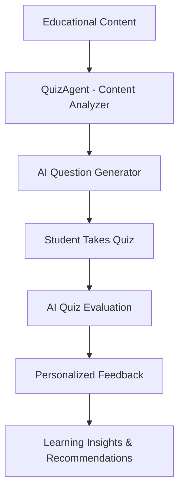

# QuizAgent

**QuizAgent** is an AI-powered orchestrator for **quiz generation, evaluation, and feedback**, designed to create a fully automated, personalized learning assessment experience.
It is part of a modular educational platform and works in combination with an API layer to deliver quizzes tailored to each learner.

---

##  What It Does

QuizAgent takes **educational content** and a **student profile**, then:

1. **Generates a personalized quiz**

   * Adapts to the student’s learning style, skill level, and strengths/weaknesses
   * Supports a customizable number of questions (minimum 8, default from configuration)
   * Uses AI (Groq-powered LLMs) to generate questions, options, correct answers, difficulty levels, and explanations

2. **Evaluates quiz answers**

   * Compares student answers to the correct ones
   * Calculates score, percentage, and detailed performance breakdown by topic and difficulty
   * Identifies strong and weak areas

3. **Generates personalized feedback**

   * Summarizes results with a friendly, student-centered message
   * Lists strengths, weaknesses, and learning insights
   * Can include explanations for incorrect answers

4. **Provides system configuration**

   * Loads settings from YAML files (`role.yaml`, `tasks.yaml`)
   * Offers question count limits and recommendations

---

## 🛠 Key Features

* **Customizable Question Counts** – Choose between 8 and 50 questions per quiz
* **Difficulty-Aware** – Tracks performance per difficulty (easy, medium, hard)
* **Topic-Wise Feedback** – Shows which topics were mastered and which need work
* **Configurable via YAML** – Easily adjust defaults, question counts, and feedback style
* **Integrated AI Models** – Works with multiple Groq LLM models (`llama3`, `llama-3.1` series)
* **Robust Error Handling** – Prevents crashes when data is incomplete or invalid

---

##  Workflow



---

## 📂 Main Components

| Method                      | Purpose                                       |
| --------------------------- | --------------------------------------------- |
| `_generate_quiz_task`       | Creates a quiz based on content and profile   |
| `_evaluate_quiz_task`       | Grades answers and analyzes performance       |
| `_give_feedback_task`       | Produces feedback with strengths & weaknesses |
| `_get_question_limits_task` | Returns min, max, default question limits     |
| `run_task`                  | Routes tasks by name for flexibility          |

---

## ⚙️ How It Works in the Platform

1. **API Layer** (FastAPI in `api.py`)
   Handles incoming requests and routes them to QuizAgent.

2. **QuizAgent Core** (`QuizAgent.py`)
   Executes the quiz generation, evaluation, and feedback tasks.

3. **Specialized Tools** (`generator`, `evaluator`, `feedback` modules)
   Perform AI generation, grading, and text analysis.

---

## Example Usage

```python
from QuizAgent import QuizAgent

# Initialize
agent = QuizAgent()

# Sample student profile
profile = {
    'name': 'Alice',
    'learning_style': 'visual',
    'initial_level': 'beginner',
    'strengths': ['problem-solving'],
    'weaknesses': ['syntax']
}

# Generate quiz
quiz = agent.run_task(
    'generate_quiz',
    profile=profile,
    module_content="Python basics and control flow...",
    milestone="Chapter 1 Assessment",
    num_questions=10
)

# Evaluate quiz
evaluation = agent.run_task(
    'evaluate_quiz',
    user_answers=['A', 'C', 'B', ...],
    correct_answers=[q['correct_answer'] for q in quiz['questions']],
    questions_metadata=quiz['questions'],
    milestone="Chapter 1 Assessment"
)

# Get feedback
feedback = agent.run_task(
    'give_feedback',
    evaluation_results=evaluation,
    profile=profile,
    milestone="Chapter 1 Assessment"
)
```

---

## License

This project is licensed under the MIT License.


