#  Quiz Agent API

**Quiz Agent API** is an **AI-powered educational quiz system** built with **FastAPI**.
It generates personalized quizzes, evaluates answers, and provides tailored feedback to enhance learning outcomes.
It also supports **content analysis** for identifying key concepts and difficulty levels in study material.

---

##  Features

* **Personalized Quiz Generation**
  Creates quizzes based on student profiles, learning styles, and content milestones.

* **Automatic Quiz Evaluation**
  Grades answers and calculates scores with detailed feedback.

* **Intelligent Feedback**
  Generates personalized insights to help students improve.

* **Content Analysis**
  Breaks down educational material into key concepts, complexity levels, and learning objectives.

* **Complete Quiz Workflow**
  From quiz creation to evaluation and feedback in a single request.

* **Backward-Compatible Endpoints**
  Maintains compatibility with older integrations.

---

##  Tech Stack

* **Backend Framework**: [FastAPI](https://fastapi.tiangolo.com/)
* **AI & NLP**: Custom quiz generation, difficulty analysis, and feedback models (Groq API supported)
* **Validation**: [Pydantic](https://docs.pydantic.dev/)
* **Web Integration**: CORS-enabled for cross-platform use
* **Server**: [Uvicorn](https://www.uvicorn.org/)

---

##  API Endpoints

| Method | Endpoint                       | Description                                |
| ------ | ------------------------------ | ------------------------------------------ |
| `GET`  | `/`                            | Root info & API metadata                   |
| `GET`  | `/health`                      | Health check                               |
| `POST` | `/quiz/generate`               | Generate a personalized quiz               |
| `POST` | `/quiz/evaluate`               | Evaluate quiz answers                      |
| `POST` | `/feedback/generate`           | Generate personalized feedback             |
| `POST` | `/content/analyze`             | Analyze educational content                |
| `POST` | `/quiz/complete-workflow`      | Generate a complete quiz package           |
| `POST` | `/quiz/submit-and-get-results` | Submit answers & get evaluation + feedback |

---

##  System Flow

```mermaid
flowchart TD
    A[📄 Educational Content] --> B[⚙️ Content Analysis]
    B --> C[🧠 AI Quiz Generation]
    C --> D[📝 Student Takes Quiz]
    D --> E[📊 Quiz Evaluation]
    E --> F[💡 Personalized Feedback]
    F --> G[📈 Learning Insights]
```



---

##  Installation

```bash
# Clone the repository
git clone https://github.com/RimeAabil/Quiz-Agent.git
cd quiz-agent-api

# Create virtual environment
python -m venv venv
source venv/bin/activate   # On Windows: venv\Scripts\activate

# Install dependencies
pip install -r requirements.txt
```

---

## 🔑 Environment Variables

Create a `.env` file in the root directory and add:

```env
GROQ_API_KEY=your_api_key_here
```

---

## ▶️ Running the API

```bash
uvicorn api:app --host 0.0.0.0 --port 8000 --reload
```

The API will be available at:
**Docs** → [http://localhost:8000/docs](http://localhost:8000/docs)
**Health Check** → [http://localhost:8000/health](http://localhost:8000/health)

---

## 🧪 Testing

Sample endpoints for testing:

* `/test/sample-profile` – Returns a mock student profile
* `/test/sample-content` – Returns example educational content

---

## 📜 License

This project is licensed under the MIT License. See the [LICENSE](LICENSE) file for details.

